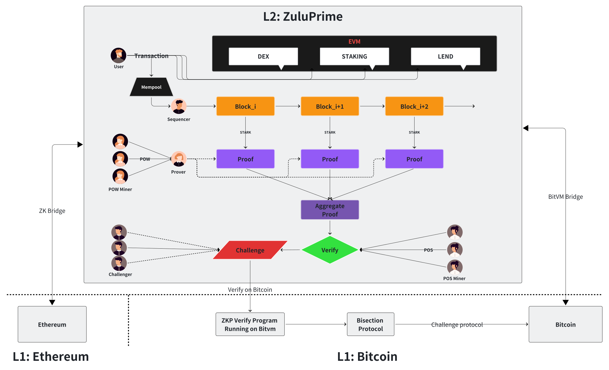
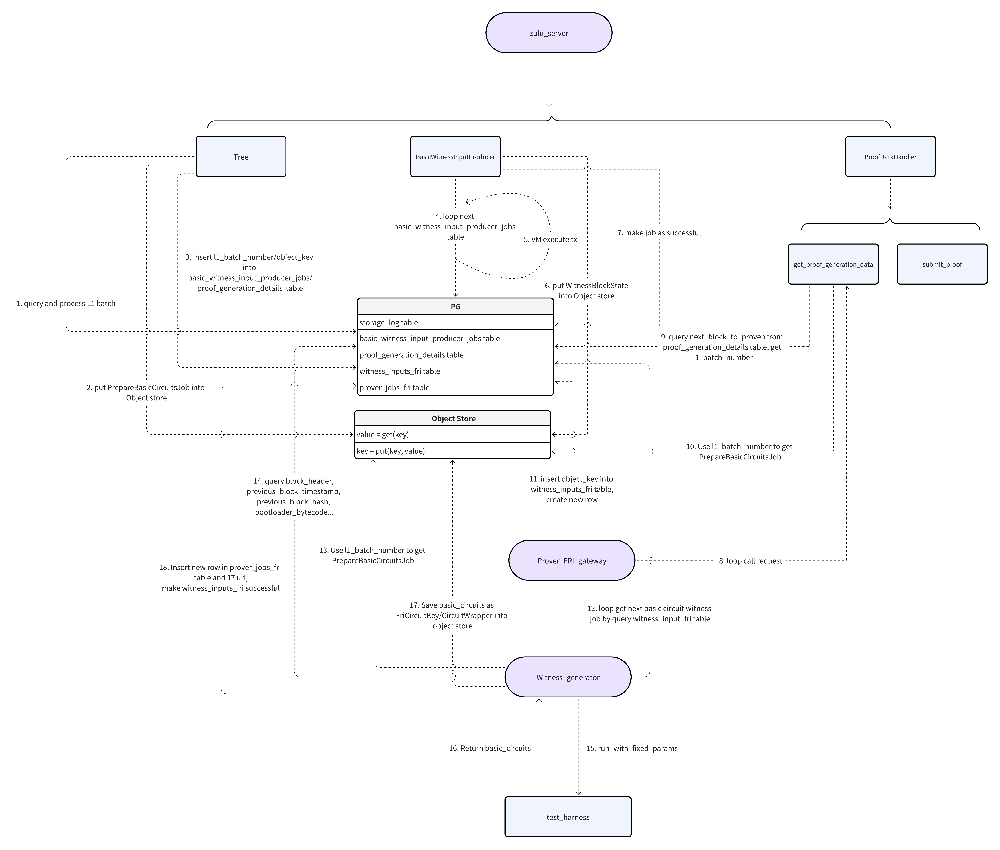

# ZuluPrime: A ZK Rollup For Scaling Bitcoin

ZuluPrime is a layer 2 rollup that uses zero-knowledge proofs to scale Bitcoin without compromising on security or
decentralization.

## 🏛 Architecture

## Components

The ZuluPrime repository has the following main components:

### 1. Smart Contracts

Zulu-Prime utilizes a suite of smart contracts to manage the protocols on both Layer 1 (L1) and Layer 2 (L2), ensuring
robust interaction and seamless bridging capabilities:

- **L1 & L2 Bridge Contracts**: Facilitate the transfer of assets between Layer 1 and Layer 2, ensuring secure and
  efficient cross-layer operations.
- **zkSync Rollup Contract on Ethereum**: Manages the rollup process, aggregating multiple L2 transactions into a single
  L1 transaction to enhance throughput and reduce costs.
- **L1 Proof Verifier Contract**: Verifies the correctness of the proofs submitted from L2, maintaining the integrity
  and security of the network.

### 2. Core App

The execution layer of Zulu-Prime, where transactions are processed and state changes are made:

- **Transaction Monitoring**: Monitors the L1 smart contracts for deposits or priority operations that affect the state
  of the blockchain.
- **Mempool Management**: Maintains a pool of pending transactions awaiting processing.
- **Transaction Execution**: Picks up transactions from the mempool, executes them in a virtual machine (VM), and
  applies state changes.
- **Block Generation**: Generates blocks for the Zulu chain.
- **Circuit Preparation**: Prepares circuits for the blocks executed, ensuring that they are ready for proof generation.
- **Proof Submission**: Submits completed blocks and their corresponding proofs to the L1 smart contract for
  verification.
- **API Services**: Provides an Ethereum-compatible web3 API to facilitate interactions with the blockchain.

### 3. Prover App

Responsible for taking blocks and metadata generated by the Core App and constructing validity zero-knowledge proofs:

- **Proof Construction**: Constructs zk proofs that confirm the validity of the blocks processed by the Core App,
  ensuring that all transactions are correctly executed according to the rules defined in the smart contracts.

### 4. Storage Layer

Acts as the single source of truth for the entire platform, ensuring that all components maintain consistency and
integrity:

- **Unified Storage**: All components and subcomponents communicate through a centralized db storage layer instead of
  direct API calls, which helps to maintain consistency and streamlines the data flow across the platform.

## Witness Generation

For the circuit preparation and proof generation, witness generation is an essential process. The process is shown in
the diagram below:

## Q&A

| Question                                                | Resource                                                         |
| ------------------------------------------------------- | ---------------------------------------------------------------- |
| What do I need to develop the project locally?          | [development.md](docs/guides/development.md)                     |
| How can I set up my dev environment?                    | [setup-dev.md](docs/guides/setup-dev.md)                         |
| How can I run the project?                              | [launch.md](docs/guides/launch.md)                               |
| What is the logical project structure and architecture? | [architecture.md](docs/guides/architecture.md)                   |
| Where can I find protocol specs?                        | [specs](docs/specs/README.md)                                    |
| Where can I find developer docs?                        | [docs](https://docs.zulunetwork.io/introduction/welcome-to-zulu) |

## Acknowledge

ZuluPirme leverages the power of [`zkStack`](https://github.com/matter-labs/zksync-era) from
[Matter Labs](https://github.com/matter-labs).
